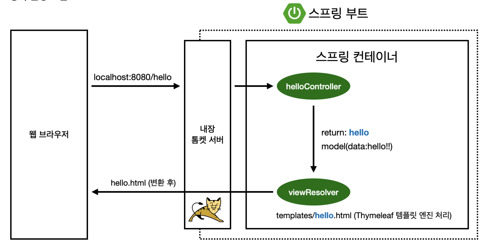

## Welcome 페이지 만들기

**/static/index.html**
~~~ html
<!DOCTYPE HTML>  
<html>  
<head>  
    <title>Hello</title>  
    <meta http-equiv="Content-Type" content="text/html; charset=UTF-8" />  
</head>  
<body>  
<h1>Welcome page</h1>  
Hello  
<a href="/hello">hello</a>  
</body>  
</html>
~~~

스프링 부트가 제공하는 welcome page 기능
static 폴더에 index.html 을 올리면 welcome page 기능을 제공한다.

**hello_spring/controller/HelloController(Class)**
~~~ java
@Controller  
public class HelloController {  
  
    @GetMapping("hello")  
    public String hello(Model model) {  
        model.addAttribute("data", "hello");  
        return "hello";  
    }
}
~~~

**resources/templates/hello.html**
~~~ html
<!DOCTYPE HTML>  
<html xmlns:th="http://www.thymeleaf.org">  
<head>  
    <title>Hello</title>  
    <meta http-equiv="Content-Type" content="text/html; charset=UTF-8" />  
</head>  
<body>  

안녕하세요. 손님
  
</body>  
</html>
~~~

## public String hello(Model model) 메서드 분석
### @GetMapping("hello")
- localhost:8080/hello로 매핑한다.(주소를 /hello로 설정)

### Model
- Model은 데이터 값을 페이지로 전달해주는 클래스라고 생각하면 된다.
- model.addAttribute("data", "hello!!");
	- hello.html에 있는 ${data} 값에 hello!!를 전달해준다.

### return "hello"; 
- 문자로 리턴 값을 넣으면 viewResolver가 화면을 찾아서 처리한다.
	 - viewResovler  -> return: "hello" -> hello + .html -> hello.html

### thymeleaf 템플릿엔진
- thymeleaf 공식 사이트: [https://www.thymeleaf.org/](https://www.thymeleaf.org/)
- 스프링 공식 튜토리얼: [https://spring.io/guides/gs/serving-web-content/](https://spring.io/guides/gs/serving-web-content/)
- 스프링 부트 메뉴얼: [https://docs.spring.io/spring-boot/](https://docs.spring.io/spring-boot/docs/2.3.1.RELEASE/reference/html/)

### thymeleaf 템플릿엔진 동작 확인

- 컨트롤러에서 리턴 값으로 문자를 반환하면 viewResolver가 화면을 찾아서 처리한다.
	- 스프링 부트 템플릿 버전 기본 viewName 매핑
	- resources: templates/ + {viewName} + .html

